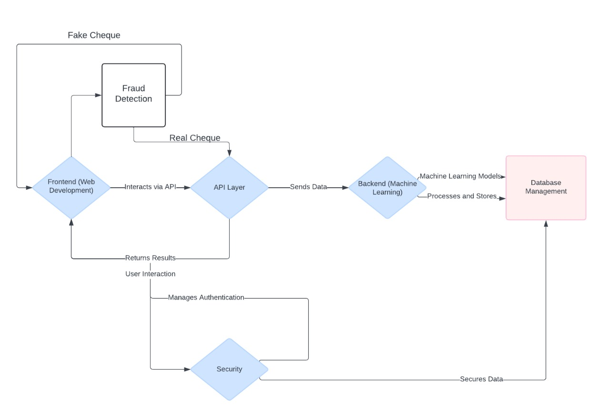

# ChequeCloud - Web-Based Cheque Processing using AWS

:warning: **This service is currently in production.**

ChequeCloud is a cloud-based web application designed to automate cheque processing and verification using AWS services. By leveraging cutting-edge OCR technology and a scalable cloud infrastructure, this service enhances accuracy, efficiency, and security in cheque handling. It provides a comprehensive solution for managing financial documents with fraud detection and secure data handling.

## Key Features

- **Automated Cheque Processing**: Utilizes **Amazon Textract** to perform Optical Character Recognition (OCR) on cheque images, extracting necessary information such as cheque number, amount, and bank details.
- **Fraud Detection**: Leverages **AWS SageMaker** machine learning models to detect fake or forged cheques.
- **Secure Data Handling**: Implements **AWS KMS** for encryption and secure storage of sensitive data, ensuring high levels of data protection.
- **Real-time API Integration**: Integrates with APIs to ensure seamless communication between frontend and backend, providing real-time updates on cheque processing.
- **Scalability**: Built using AWS serverless architecture, ensuring scalability and reliability for growing workloads.
- **Monitoring and Performance**: **Amazon CloudWatch** tracks application performance and system metrics to ensure reliability and detect anomalies in cheque processing workflows.

## Technology Stack

- **Frontend**:
  - **Languages**: React.js, Bootstrap
  - **Key Features**: Responsive design, user-friendly cheque submission, real-time results

- **Backend**:
  - **Languages/Frameworks**: Python, AWS Lambda
  - **Key Features**: RESTful APIs, machine learning integration, fraud detection logic

- **Database**:
  - **Type**: Amazon RDS (MySQL)
  - **Purpose**: Stores cheque data, user information, and metadata

- **OCR Processing**:
  - **Service**: Amazon Textract
  - **Function**: Extracts key information from cheque images

- **Machine Learning**:
  - **Platform**: AWS SageMaker
  - **Purpose**: Detects fraudulent cheques
  - **Libraries**: TensorFlow, Scikit-learn

- **Security**:
  - **Service**: AWS KMS (Key Management Service)
  - **Purpose**: Data encryption and secure storage

- **Monitoring**:
  - **Service**: Amazon CloudWatch
  - **Purpose**: Tracks performance, monitors logs, and optimizes system

- **Hosting**:
  - **Platform**: AWS Lambda, S3, CloudWatch, and **Amazon EC2** for scalable compute resources

## System Architecture

The architecture of ChequeCloud consists of several core components:
1. **Frontend**: A React.js interface allowing users to upload and submit cheque images for processing.
2. **API Gateway**: Facilitates communication between frontend and backend, processing user requests through AWS Lambda functions.
3. **Machine Learning Backend**: Cheque images are analyzed using ML models in **AWS SageMaker**, detecting any anomalies or fraudulent behavior.
4. **Database (Amazon RDS)**: All cheque and user data are stored and managed in a secure MySQL instance.
5. **Security**: The entire system is secured using **AWS KMS** for encryption, ensuring all data is handled with industry-standard security protocols.
6. **Monitoring**: **Amazon CloudWatch** logs and tracks performance to ensure the application runs smoothly and detects any issues in real-time.



## Working Mechanism

1. :bust_in_silhouette: **User Interaction**:
   - The user accesses the ChequeCloud web application through a user-friendly interface developed using **React.js**. This interface allows users to upload images of cheques that need to be processed.
   - The web application is responsive, ensuring that users can easily interact with it across devices such as desktops, tablets, and mobile phones.

2. :inbox_tray: **Image Submission and API Request**:
   - Once the cheque image is uploaded, the frontend triggers an API request through **Amazon API Gateway**.
   - The request is routed to a **serverless backend** managed by **AWS Lambda**, which handles the business logic and initiates the cheque processing workflow.

3. :mag: **OCR Processing**:
   - The uploaded cheque image is passed to **Amazon Textract**, a powerful OCR service, which extracts essential details such as the cheque number, amount, and bank information.
   - The extracted data is sent back to the backend, where it is prepared for further analysis.

4. :closed_lock_with_key: **Fraud Detection**:
   - The extracted data from the cheque is then passed through a machine learning model hosted on **AWS SageMaker**.
   - This model, trained using historical cheque data, evaluates the cheque for any signs of fraud (e.g., forgery or tampering).
   - If the cheque is deemed fraudulent, an alert is generated, and the cheque is flagged for further manual review.

5. :file_folder: **Data Storage and Management**:
   - All cheque-related data, including images, extracted details, and processing results, are securely stored in a **MySQL database** hosted on **Amazon RDS**.
   - The database stores user profiles, transaction histories, and processed cheque information, enabling efficient retrieval and management of cheque data.

6. :lock: **Data Encryption**:
   - Sensitive information, such as cheque details and user data, is encrypted using **AWS KMS** (Key Management Service).
   - This ensures that all sensitive data remains secure, both in transit and at rest, protecting it from unauthorized access.

7. :bar_chart: **Real-time Monitoring**:
   - As the system processes cheques, **Amazon CloudWatch** monitors the performance of all services, providing real-time metrics on processing speed, system errors, and overall health.
   - Logs generated by AWS Lambda and other services are also captured by CloudWatch for detailed analysis and troubleshooting.

8. :incoming_envelope: **User Feedback**:
   - Once the cheque has been successfully processed or flagged for review, the user receives the results directly on the web application.
   - For successful cheques, users are notified of the verification status. For flagged cheques, users are informed of potential fraud, and further steps are advised.

9. :key: **Access Control and Security**:
   - **AWS IAM** (Identity and Access Management) ensures that only authorized users can access the system’s functionalities.
   - Users are required to log in before uploading cheques, and access permissions are managed to secure sensitive data and processing workflows.

## Additional Features

- **Fraud Detection**: Machine learning models actively detect potential forgery or fraud in submitted cheques.
- **Data Encryption**: Encryption services through AWS KMS ensure that all sensitive information is securely handled and protected.
- **Real-time Processing**: Cheques are processed and verified in real-time, offering immediate feedback to users.
- **System Monitoring**: **Amazon CloudWatch** logs performance metrics, monitors errors, and provides real-time insights to ensure application reliability.

## TODOs:

- [ ] **Optimize Fraud Detection Models**: Improve the fraud detection algorithms using advanced machine learning techniques.
- [ ] **Implement User Authentication**: Add authentication via **AWS Cognito** for secure user login and account management.
- [x] **Enhance Frontend UX**: Make the user interface more intuitive with additional feedback messages and error handling.
- [ ] **Add Multi-language Support**: Support additional languages to expand the app’s usability in different regions.
- [ ] **Enable Cheque Metadata Analysis**: Add functionality to extract more metadata (e.g., signature, date) for detailed verification.
- [ ] **Develop a Mobile App Version**: Build a cross-platform mobile app using React Native to make the service accessible on mobile devices.


## How to Run the Project Locally

1. Clone the repository:
   ```bash
   git clone https://github.com/asif-mp3/ChequeCloud.git

2. **Navigate into the project directory:**
    ```bash
    cd ChequeCloud
    ```

3. **Install backend dependencies:**
    ```bash
    npm install
    ```

4. **Install Python dependencies:**
    - First, make sure you have Python set up.
    - Then, install required libraries:
    ```bash
    pip install -r requirements.txt
    ```
